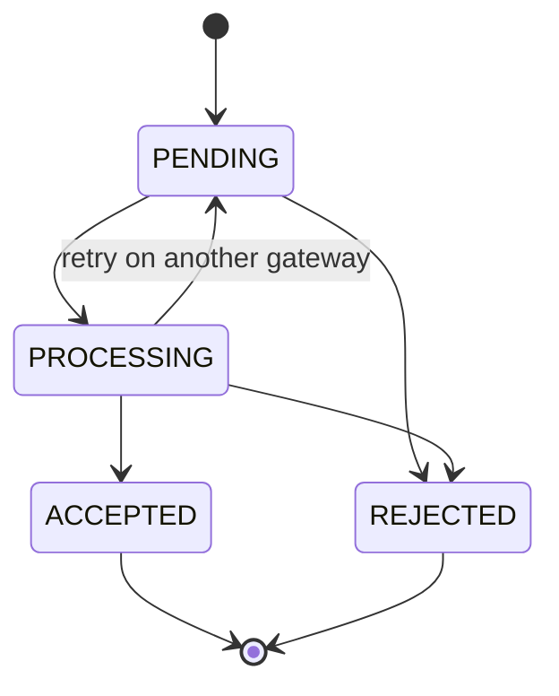

# Payment Orchestration Layer

A small payment orchestration service built with FastAPI and SQLite. It accepts payment requests, routes them across several (mock) payment gateways with automatic failover, and finalizes transactions from signed gateway webhooks.

The goal of the project is to get the hard parts of payment systems right at small scale: never charging twice, never losing a state change, and never trusting an unverified webhook.

## Features

- **Failover routing**: gateways are tried in order of historical success rate; a failed gateway is skipped and the next one is tried.
- **Circuit breaker** per gateway (`CLOSED` / `OPEN` / `HALF_OPEN`), so a failing gateway is not hammered.
- **Idempotency keys**: retrying `POST /transactions` with the same `Idempotency-Key` returns the original transaction and charges once. The same key with a different body is rejected.
- **Transaction state machine**: only valid transitions are allowed; `ACCEPTED` and `REJECTED` are terminal.
- **Webhook handling**: HMAC-SHA256 signature verification, deduplication by `webhook_id`, amount reconciliation, and detection of webhooks that contradict a terminal state.
- **Atomic writes**: related writes (for example "mark webhook processed" and "save new status") commit together or not at all.
- **Optimistic locking**: a `version` column detects concurrent modification instead of silently overwriting (lost update).
- **Money as integers**: amounts are integer minor units (`1050` = 10.50 EUR), never floats.

## Transaction states



## How a payment flows

1. `POST /transactions` reserves the idempotency key and saves the transaction as `PENDING` in **one** database transaction.
2. Gateways are sorted by success rate. For each one: check the circuit breaker and health, then try the payment (up to 3 attempts).
3. On success the gateway/transaction pair is recorded in the payment registry (so a retry never sends the same payment to the same gateway twice) and the transaction moves to `PROCESSING`.
4. If every gateway fails, the transaction becomes `REJECTED`.
5. The gateway later calls `POST /webhooks`. A valid, signed webhook moves the transaction to `ACCEPTED` or `REJECTED`.

## API

Amounts are integer minor units. Supported currencies: `EUR`, `RON`, `USD`, `GBP`.

| Method | Path | Description |
|---|---|---|
| `GET` | `/` | Health message |
| `POST` | `/transactions` | Create and process a payment. Requires the `Idempotency-Key` header (max 255 chars) |
| `GET` | `/transactions/{transaction_id}` | Get a transaction |
| `POST` | `/webhooks` | Gateway callback. Requires the `X-Signature` header |

**`POST /transactions` status codes:** `200` ok or replay of the same request, `400` missing key, `422` invalid body or key reused with a different body, `409` original request still being created or concurrent modification.

**`POST /webhooks` status codes:** `200` (`processed` tells whether it was applied), `401` missing or invalid signature, `404` unknown transaction, `409` concurrent modification (retry), `422` invalid payload, `500` webhook secret not configured.

```bash
curl -X POST http://127.0.0.1:8000/transactions \
  -H "Content-Type: application/json" \
  -H "Idempotency-Key: order-1001" \
  -d '{"amount": 1050, "currency": "EUR"}'
```

### Webhook signatures

`X-Signature` is the hex HMAC-SHA256 of the **raw request body**, using the shared secret from the `WEBHOOK_SECRET` environment variable. From the project root:

```python
import json
import httpx
from core.webhook_security import sign_payload

body = json.dumps({
    "webhook_id": "wh_1",
    "transaction_id": "<transaction id>",
    "amount": 1050,
    "status": "succeeded",   # or "failed"
}).encode()

response = httpx.post(
    "http://127.0.0.1:8000/webhooks",
    content=body,
    headers={"X-Signature": sign_payload("your-secret", body), "Content-Type": "application/json"},
)
print(response.json())
```

## Running it

Requires Python 3.10+.

```bash
pip install -r requirements.txt

# Linux / macOS
export WEBHOOK_SECRET="a-long-random-secret"
# Windows PowerShell
$env:WEBHOOK_SECRET="a-long-random-secret"

uvicorn api:app --reload
```

Without `WEBHOOK_SECRET` the webhook endpoint refuses every request (fails closed).

The gateways are mocks with random failures and health, so results vary between runs. `python main.py` runs a demo without HTTP: failover, a webhook, and the circuit breaker.

## Tests

```bash
pytest
```

74 tests covering the state machine, circuit breaker, failover, idempotency, webhook rules, HMAC verification, atomic transactions, optimistic locking, and the HTTP API. Tests use in-memory SQLite and a deterministic fake gateway.

## Project layout

```
api.py                  FastAPI app: endpoints and webhook signature check
main.py                 Demo without HTTP
core/
  transaction.py        Transaction model and state changes
  status.py             Status enum and allowed transitions
  orchestrator.py       Failover routing and payment processing
  breaker.py            Circuit breaker
  database.py           Shared SQLite connection, transaction() block
  repository.py         Persistence and optimistic locking
  idempotency.py        Idempotency key store
  payment_registry.py   Which transaction was paid on which gateway
  webhook.py            Webhook deduplication and reconciliation
  webhook_security.py   HMAC sign / verify
gateways/               Gateway interface and four mocks
tests/
```

## Design decisions

- **One shared database connection.** Every store uses the same `Database`, so related writes can be grouped in one `transaction()` block. A lock protects the connection because FastAPI runs sync endpoints in a thread pool.
- **Payment registry commits on its own.** Once the gateway has taken the money, that fact must survive even if saving the status fails. If both were one transaction, a failed save would roll back the record and a retry would charge the customer again.
- **A failed status change after a successful payment raises instead of failing over.** The money moved but the state is unknown, so trying another gateway could double charge. That case needs manual intervention.
- **The webhook is marked processed only after it was applied**, in the same transaction as the status save. If saving fails, the gateway's retry is still accepted.
- **Signatures are checked on the raw bytes, before parsing or any database read.** An unsigned request gets `401` even for an unknown transaction, so ids cannot be probed. The comparison is constant-time.

## Known limitations

This is a learning project. These are deliberate simplifications, with what I would do at scale:

- **SQLite with a single connection and a lock.** Cannot run as several processes. At scale: PostgreSQL with row-level locking, keeping the version column.
- **Circuit breaker state and gateway statistics live in process memory.** With several instances each one has its own view. At scale: a shared store such as Redis.
- **Gateway calls are synchronous inside the request**, with sleeps that simulate latency and no timeouts. At scale: a background worker or queue, and `202 Accepted` to the client.
- **The idempotency key is not sent to the gateway.** A crash between "gateway accepted" and "recorded in the registry" can still double charge, and failing over after a timeout has an ambiguous outcome. At scale: send the key to the gateway and reconcile by querying it.
- **No replay protection beyond `webhook_id` deduplication.** The signature has no timestamp, and the processed-webhooks table only grows. At scale: signed timestamp with a tolerance window, expiry of old ids, secret rotation.
- **A transaction waits for its webhook.** If the webhook never arrives it stays in `PROCESSING`. At scale: a timeout and a reconciliation job that asks the gateway.
- **No authentication** on the API.
- **Only the latest state is stored**, no history of transitions or audit log.
- **No refunds, partial captures, currency conversion, or ledger.**
- **No CI**, and `requirements.txt` is a plain `pip freeze`.